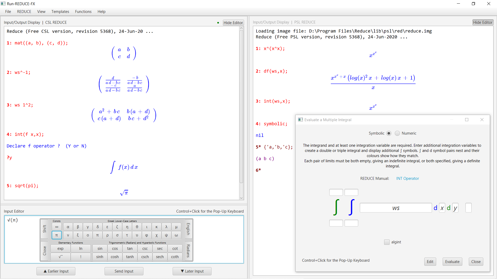

# Run-REDUCE Introduction

### Key links: [Releases](https://github.com/fjwright/Run-REDUCE/releases) | [Install and Run Guide](InstallAndRun.md) | [User Guide](UserGuide.html)

Run-REDUCE is a Graphical User Interface (see the [screen
shot](#ScreenShot) below) for running the
[REDUCE](https://reduce-algebra.sourceforge.io/) Computer Algebra
System.  It is implemented in JavaFX and should provide a consistent
user experience across all implementations of REDUCE and all platforms
(that support Java).  Self-contained installers are available on the
[releases page](https://github.com/fjwright/Run-REDUCE/releases) for
Windows and Gnu/Linux.  Alternatively, and for other platforms, a Java
JAR file is available.

REDUCE itself is an open source project available from
[SourceForge](https://sourceforge.net/projects/reduce-algebra/), which
you need to install separately.  Run-REDUCE is designed to run a
standard installation of REDUCE; it does not include REDUCE.

Full information about how to install and run Run-REDUCE is
available in the [Install and Run Guide](InstallAndRun.md).  For
information about how to use Run-REDUCE please see the [User
Guide](UserGuide.html) (which is also included in Run-REDUCE and
easily accessible via the Help menu).  Known issues are listed at end
of the [Install and Run Guide](InstallAndRun.md).

(The screen shot below relates to an earlier
release and is now a little out of date!)

Run-REDUCE is still under development but here are the key features
that it currently provides:

* Commands to run REDUCE that are fully configurable but default to
  running CSL and PSL REDUCE as appropriate for the standard
  distributions.
* A REDUCE input/output display pane that scrolls in both directions
  as necessary.  Its contents can be printed, saved to a file and/or
  erased.
* Optional typeset-style display of mathematical output.
* A multi-line input editing pane that also scrolls in both directions
  as necessary.  Previous input is remembered and can be scrolled
  through, edited and re-input.  A final terminator is normally added
  automatically if appropriate when input is sent to REDUCE.
* Optional split or tabbed panes running independent REDUCE sessions.
* Menu items to handle REDUCE file input/output and load standard
  REDUCE packages, similar to the facilities provided by the CSL
  REDUCE GUI.
* Optional bold prompts and coloured input/output text (similar to
  redfront but determined by the input mode &ndash; algebraic or
  symbolic).
* Templates to construct structured expressions and statements.
* A pop-up keyboard to access symbolic constants, Greek letters and
  elementary functions.
* Dialogues to access standard mathematical functions using
  conventional notation.
* Easy access to the Run-REDUCE User Guide, the standard documentation
  distributed with REDUCE as HTML or PDF files, the REDUCE web site
  and the SourceForge REDUCE project site.

Francis Wright, March 2021
