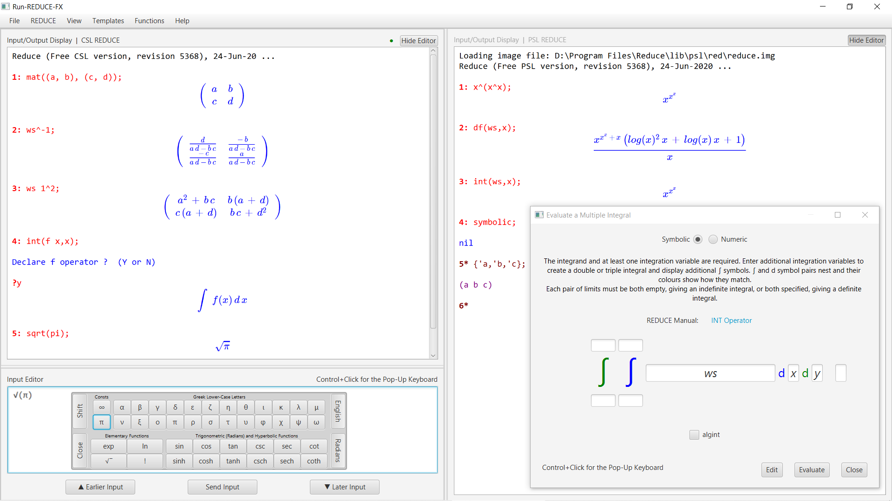

### [Run-REDUCE-FX.jar](https://github.com/fjwright/Run-REDUCE-FX/releases/latest/download/Run-REDUCE-FX.jar) :: [Install and Run](InstallAndRun.md) :: [User Guide](UserGuide.html)

Run-REDUCE-FX is a Graphical User Interface for running the
[REDUCE](https://reduce-algebra.sourceforge.io/) Computer Algebra
System that should provide a fairly consistent user experience across
all platforms.  It is implemented in JavaFX and the executable
application takes the form of the JAR file *Run-REDUCE-FX.jar*.  Click
on the link above to download the latest release.

REDUCE itself is an open source project available from
[SourceForge](https://sourceforge.net/projects/reduce-algebra/), which
you need to install separately.  Run-REDUCE-FX is designed to run a
standard installation of REDUCE; it does not include REDUCE.

Full information about how to install and run Run-REDUCE-FX is
available in the [Install and Run Guide](InstallAndRun.md).  For
information about how to use Run-REDUCE-FX please see the [User
Guide](UserGuide.html) (which is also included in Run-REDUCE-FX and
easily accessible via the Help menu).  Known issues are listed at end
of the [Installation Guide](InstallationGuide.md).

Run-REDUCE-FX is still under development but here are the key features
that it currently provides:

* Commands to run REDUCE that are fully configurable but default to
  running CSL and PSL REDUCE as appropriate for the standard
  distributions.
* A REDUCE input/output display pane that scrolls in both directions
  as necessary.  Its contents can be saved to a file and/or erased.
* A multi-line input editing pane that also scrolls in both directions
  as necessary.  Previous input is remembered and can be scrolled
  through, edited and re-input.  A final terminator can be added
  automatically if appropriate when input is sent to REDUCE.
* Options to make the REDUCE input prompt bold and to colour the
  input/output display based on the input mode or redfront.
* Menu options to handle REDUCE file input/output and load standard
  REDUCE packages, similar to the facilities provided by the CSL
  REDUCE GUI.
* Easy access to the Run-REDUCE-FX User Guide and some of the standard
  documentation distributed with REDUCE as HTML or PDF files.
* Split or tabbed panes running independent REDUCE processes.

In future I hope to implement typeset-style display of mathematics.

Francis Wright, May 2020
